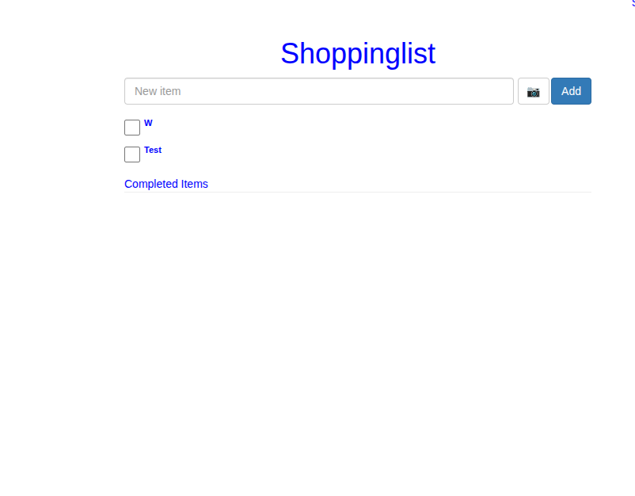

# Shoppinglist app: SignalR based shopping list for quick syncing accross devices and users

Very quick and dirty shoppinglist webapp. Solves an annoyance I had with existing shoppinglist, which probably are polling-based, and took anywhere from 2 seconds to 20 seconds between updates. Websocket based updates solves this.

No fancy javascript latest framework or whatever. 

